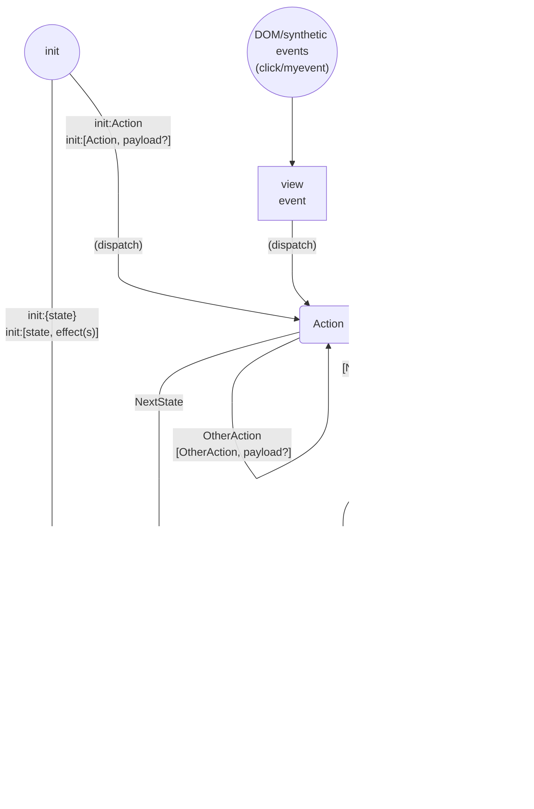

```mermaid
graph TD
    init(("&nbsp;&nbsp;&nbsp;&nbsp;&nbsp;init&nbsp;&nbsp;&nbsp;&nbsp;&nbsp;"))
    init --- |"init:{state}<br/>init:[state, effect(s)]<br/>"|j9[" "] -->nextState
    init --- |"init:Action<br/>init:[Action, payload?]"|j0[ ]
    j0 --- |"(dispatch)"|j8[ ] --> Action
    domevent(("DOM/synthetic&nbsp;<br/>events<br/>&nbsp;(click/myevent)&nbsp;")) --> viewEvent[view<br/>event]
    viewEvent --- |"(dispatch)"|j6[ ] --> Action
    externalEvents(("global/external<br/>processes<br/>&nbsp;(window resize)&nbsp;")) --> subscription
    subscription --- |"(dispatch)"|j7[ ] -->Action
    Action("&nbsp;Action&nbsp;<br/>") -->|"OtherAction<br/>&nbsp;[OtherAction, payload?]<br/>"|Action
    Action --- |"NextState"|j14[ ] --- j15[ ] ---nextState[next<br/>state]
    Action --- |"[NextState, ...Effects]"|j16[ ] --- j3[ ]
    j3 --- j10[ ] --> nextState
    j3 --- j4[ ] --> effect["Effect"]
    effect --- j13[ ] --> runEffect(("&nbsp;external/<br/>impure code"))
    runEffect --> |"dispatch<br/>(optional)"|Action
    nextState --- j5[ ]
    j5 --> |"view(state)"|newDom(("&nbsp;&nbsp;&nbsp;(re)render&nbsp;&nbsp;<br/>&nbsp;&nbsp;&nbsp;&nbsp;DOM&nbsp;&nbsp;&nbsp;"))
    j5 --> |"subscriptions(state)"|recalcSubs((recalc<br/>subscriptions))
    
    style j0 height:0px;
    style j3 height:0px;
    style j4 height:0px;
    style j5 height:0px;
    style j6 height:0px;
    style j7 height:0px;
    style j8 height:0px;
    style j9 height:0px;
    style j9 width:150px;
    style j10 height:0px;
    style j13 height:0px;
    style j14 height:0px;
    style j15 height:0px;
    style j16 height:0px;
```
