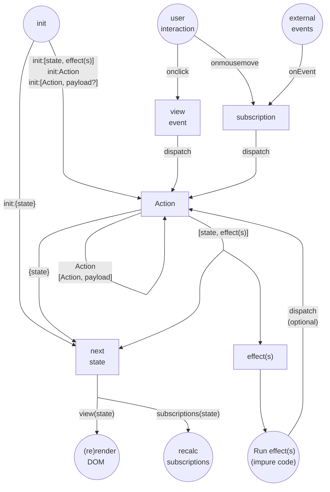

```mermaid
graph TD
    userInteraction((user<br/>interaction)) -->|onclick| viewEvent[view<br/>event]
    init(("&nbsp;&nbsp;&nbsp;&nbsp;&nbsp;init&nbsp;&nbsp;&nbsp;&nbsp;&nbsp;"))
    init --> |"init:{state}"|nextState
    userInteraction -->|onmousemove| subscription
    init --- |"init:[state, effect(s)]<br/>init:Action<br/>init:[Action, payload?]"|j0[ ]
    j0 --- j8[ ] --> Action
    viewEvent --- |dispatch|j6[ ] --> Action
    externalEvents(("&nbsp;&nbsp;external&nbsp;&nbsp;<br/>events")) -->|onEvent| subscription
    subscription --- |dispatch|j7[ ] -->Action
    Action -->|"Action<br/>[Action, payload]"|Action
    Action --> |"{state}"| nextState[next<br/>state]
    Action --- |"[state, effect(s)]"|j3[ ]
    j3 --- j10[ ] --> nextState
    j3 --- j4[ ] --> effect["effect(s)"]
    effect --- j13[ ] --> runEffect(("&nbsp;Run effect(s)<br/>(impure code)"))
    runEffect --> |"dispatch<br/>(optional)"|Action
    nextState --- j5[ ]
    j5 --> |"view(state)"|newDom(("&nbsp;&nbsp;&nbsp;(re)render<br/>&nbsp;&nbsp;DOM&nbsp;&nbsp;&nbsp;"))
    j5 --> |"subscriptions(state)"|recalcSubs((recalc<br/>subscriptions))
    
    style j0 height:0px;
    style j3 height:0px;
    style j4 height:0px;
    style j5 height:0px;
    style j6 height:0px;
    style j7 height:0px;
    style j8 height:0px;
    style j10 height:0px;
    style j13 height:0px;
```
