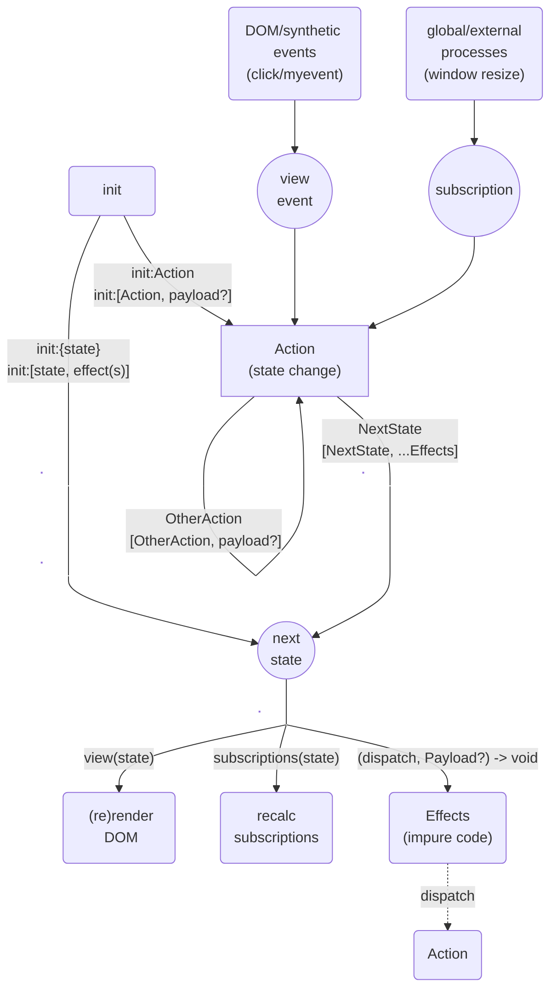

```mermaid
graph TD
    init("&nbsp;&nbsp;&nbsp;&nbsp;&nbsp;init&nbsp;&nbsp;&nbsp;&nbsp;&nbsp;")
    init --- |"init:{state}<br/>init:[state, effect(s)]<br/>"|j0[ ] --- j1[ ] -->nextState
    init --> |"init:Action<br/>init:[Action, payload?]"|Action

    domevent("DOM/synthetic&nbsp;<br/>events<br/>&nbsp;(click/myevent)&nbsp;") --> viewEvent
    viewEvent(("&nbsp;&nbsp;&nbsp;&nbsp;view&nbsp;&nbsp;&nbsp;&nbsp;<br/>event")) --> Action
    externalEvents("global/external<br/>processes<br/>&nbsp;(window resize)&nbsp;") --> subscription
    subscription(("subscription")) -->Action

    Action["&nbsp;Action&nbsp;<br/>(state change)"] -->|"OtherAction<br/>&nbsp;[OtherAction, payload?]<br/>"|Action
    Action --- |"NextState<br/>[NextState, ...Effects]"|j2[ ] ---> nextState
    
    nextState(("&nbsp;&nbsp;next&nbsp;&nbsp;<br/>state")) --- j3[ ]
    j3 --> |"view(state)"|newDom("&nbsp;&nbsp;&nbsp;(re)render&nbsp;&nbsp;<br/>&nbsp;&nbsp;&nbsp;&nbsp;DOM&nbsp;&nbsp;&nbsp;")
    j3 --> |"subscriptions(state)"|recalcSubs(recalc<br/>subscriptions)
    j3 --> |"(dispatch, Payload?) -> void"|effect
    effect("Effects<br>(impure code)") -.-> |"dispatch"|dispatchAction("Action")
    
    style j0 height:1px;
    style j0 width:1px;
    style j1 height:1px;
    style j1 width:1px;
    style j2 height:1px;
    style j2 width:1px;
    style j3 height:1px;
    style j3 width:1px;
```
